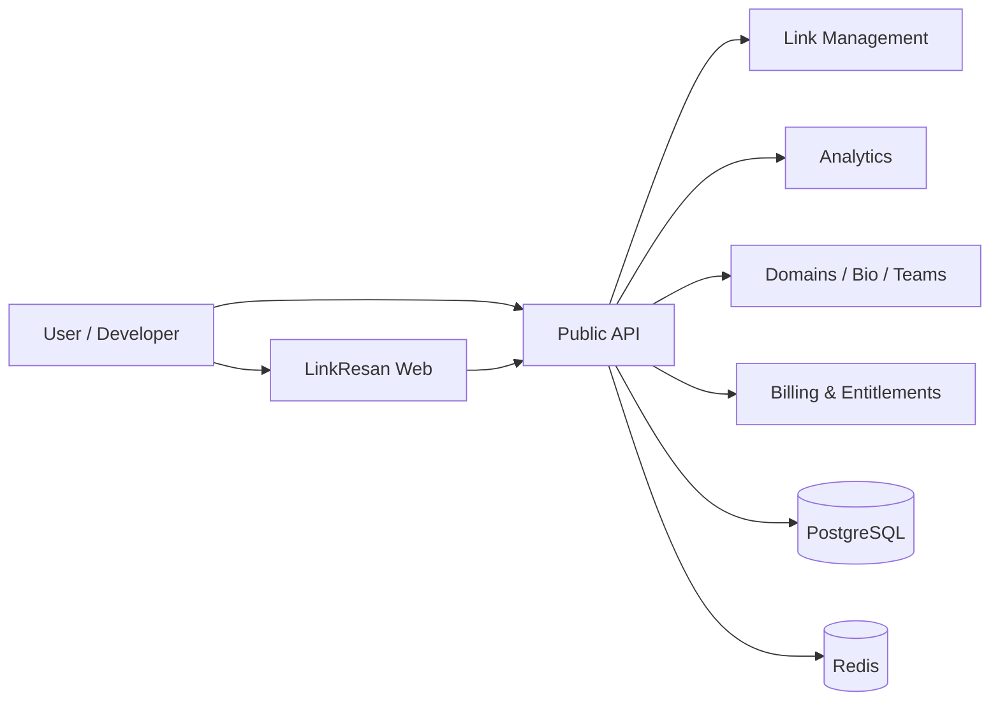

# 🔗 LinkResan | لینک‌رسان

### لینک کوتاه حرفه‌ای برای کاربران، تیم‌ها و توسعه‌دهندگان فارسی‌زبان
### Professional link management for Persian-first users, teams, and developers

[وب‌سایت](https://linkresan.ir) · [قیمت‌گذاری](https://linkresan.ir/pricing) · [مستندات API](https://linkresan-api.onrender.com/docs) · [دانش‌نامه](https://linkresan.ir/knowledge)

---

## محصول چیست؟ | What is LinkResan?

**لینک‌رسان** یک پلتفرم SaaS فارسی‌محور برای کوتاه‌سازی، مدیریت، تحلیل و توزیع لینک است. تجربه وب برای RTL و زبان فارسی طراحی شده و قابلیت‌های محصول از یک کاتالوگ canonical در Production کنترل می‌شوند.

**LinkResan** is a Persian-first SaaS platform for shortening, managing, analyzing, and distributing links. Product claims in this public repository are intentionally derived from verified Production product truth.

> **Repository role:** این ریپازیتوری، ویترین عمومی محصول و رکورد توسعه‌دهنده است. پیاده‌سازی تجاری Production، زیرساخت عملیاتی، billing internals، CRM/admin internals و private evidence در ریپوی خصوصی `LinkResan-Production` نگهداری می‌شوند و به‌صورت کامل mirror نمی‌شوند.

---

## وضعیت قابلیت‌ها | Product status

| دسته | قابلیت | وضعیت |
|---|---|---|
| Link Management | کوتاه‌سازی لینک | ✅ Shipped |
| Link Management | اسلاگ دلخواه | ✅ Shipped |
| Link Management | تاریخ انقضا و محدودیت کلیک | ✅ Shipped |
| Link Management | لینک رمزدار | ✅ Shipped |
| Link Management | ساخت انبوه CSV | ✅ Shipped |
| Intelligence | تولید نام با AI | ✅ Shipped |
| Analytics | آمار کلیک | ✅ Shipped |
| Analytics | مرورگر/سیستم‌عامل و نمودار هفتگی | 🟡 Partial |
| Analytics | نگهداری داده تحلیلی بر اساس پلن | 🟡 Partial |
| Campaigns | UTM Builder | 🟡 Partial |
| Branding | دامنه اختصاصی | ✅ Shipped |
| Creator | Link-in-bio | ✅ Shipped |
| Developers | API Keys | ✅ Shipped |
| Developers | Webhooks | ✅ Shipped |
| Collaboration | Team management | ✅ Shipped |
| Localization | Persian / RTL | ✅ Shipped |
| Billing | پرداخت ریالی | ✅ Shipped |
| Billing | پرداخت رمزارزی | ❌ Not shipped |
| Mobile | کلاینت Native | 🟡 Preview / Partial |
| Open Source | هسته/مواد عمومی منتخب | 🟡 Partial — commercial Production is private |

> وضعیت‌ها از canonical product catalog در Production نگهداری می‌شوند. قابلیت `Partial` در این README عمداً به‌عنوان «کامل» تبلیغ نمی‌شود.

---

## پلن‌ها | Plans

LinkResan currently exposes four product tiers: **Free, Basic, Pro, Enterprise**. قیمت و entitlementها ممکن است تغییر کنند؛ برای مقدار canonical همیشه صفحه [Pricing](https://linkresan.ir/pricing) را ببینید.

نمونه محدودیت‌های فعلی که در Production enforce می‌شوند:

- Free: تا ۵۰ لینک در ماه، ۱ API key، ۱ webhook، تیم ۲ نفره
- Basic: لینک نامحدود، ۲ API key، ۲ webhook، تیم ۵ نفره
- Pro: ۵ API key، ۵ webhook، تیم ۱۰ نفره
- Enterprise: ۲۰ API key، ۲۰ webhook، تا ۵ دامنه اختصاصی، تیم ۲۵ نفره

---

## معماری عمومی | Public architecture

```mermaid
flowchart LR
    U[User / Developer] --> W[LinkResan Web]
    U --> API[Public API]
    W --> API
    API --> L[Link Management]
    API --> A[Analytics]
    API --> D[Domains / Bio / Teams]
    API --> B[Billing & Entitlements]
    API --> DB[(PostgreSQL)]
    API --> C[(Redis)]
```

این نمودار عمداً سطح بالا است. topology عملیاتی، deployment identifiers، private database configuration، billing reconciliation internals و admin/CRM implementation عمومی نمی‌شوند.

[جزئیات معماری عمومی](docs/ARCHITECTURE.md)

---

## Technology stack

| Layer | Technology |
|---|---|
| Backend | Go 1.25.x, Fiber 2.52.x |
| Web | Next.js 16, React 19, TypeScript |
| Data | PostgreSQL |
| Cache | Redis |
| API contract | OpenAPI / Swagger |
| Product UI | Persian-first RTL, responsive web |

---

## امنیت و حریم خصوصی | Security & privacy

ما ادعاهای امنیتی را فقط در حد رفتار verify‌شده بیان می‌کنیم:

- authentication و session handling در سمت سرور enforce می‌شوند؛
- plan/entitlement enforcement server-authoritative است؛
- پرداخت ریالی تنها پس از verification معتبر مبنای entitlement قرار می‌گیرد؛
- secrets، credentials، session tokens، database URLs، gateway identifiers و private audit evidence بخشی از public sync نیستند؛
- public synchronization با allowlist و fail-closed guards انجام می‌شود.

برای گزارش آسیب‌پذیری، اطلاعات حساس را در Issue عمومی قرار ندهید؛ از مسیر تماس سایت استفاده کنید.

[Security guidance](docs/SECURITY.md)

---

## توسعه‌دهندگان | Developers

- Swagger / OpenAPI: https://linkresan-api.onrender.com/docs
- API keys از داخل داشبورد کاربر مدیریت می‌شوند.
- Webhooks برای integrationهای محصول موجود هستند.
- نمونه‌ها و contractهای عمومی فقط زمانی اینجا منتشر می‌شوند که public-safe باشند.

[Developer entry point](docs/DEVELOPERS.md)

---

## Roadmap & status

این ریپو roadmap تجاری محرمانه را منتشر نمی‌کند. فقط وضعیت public-safe قابلیت‌ها و milestoneهای پذیرفته‌شده منتشر می‌شود.

[Public roadmap](docs/ROADMAP.md) · [Machine-readable status](status.json)

---

## Release history

Releaseهای این public repository رکورد عمومی و sanitize‌شده milestoneها هستند و لزوماً با release artifact داخلی Production یکسان نیستند. جزئیات عملیاتی و private evidence در Production باقی می‌مانند.

[GitHub Releases](https://github.com/AmirMotefaker/LinkResan/releases)

---

## Knowledge base

دانش‌نامه محصول در خود سرویس نگهداری می‌شود:

https://linkresan.ir/knowledge

---

## Contribution, support & contact

این repository برای documentation، public-safe examples، product feedback و issue tracking مناسب است. مشارکت روی private commercial implementation از طریق این repo انجام نمی‌شود.

- Product: https://linkresan.ir
- Contact: https://linkresan.ir/contact
- Public issues: https://github.com/AmirMotefaker/LinkResan/issues

---

## Public / Private boundary

**Public (`AmirMotefaker/LinkResan`)**

- brand and product landing
- public-safe feature/status documentation
- sanitized release notes and roadmap summaries
- developer entry points and selected examples

**Private (`AmirMotefaker/LinkResan-Production`)**

- canonical production source
- admin/CRM implementation
- payment and reconciliation internals
- deployment workflows and environment configuration
- operational evidence and private audit data

The private Production repository remains the sole production source of truth.

---

Public snapshot source: Production Issue #63 / PR #65 · refreshed 2026-08-19
