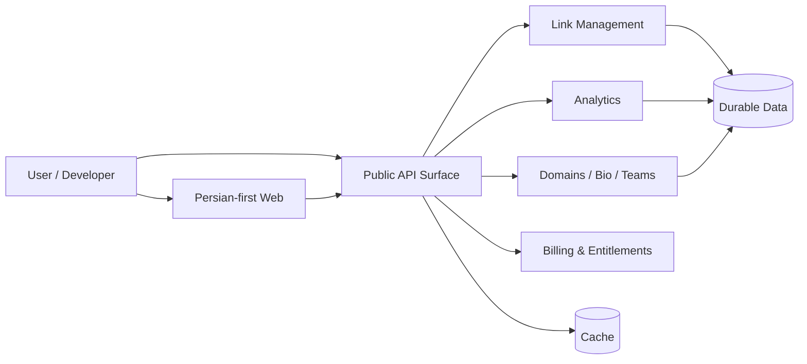

# 🔗 LinkResan | لینک‌رسان

### لینک هوشمند، تحلیل قابل‌فهم، تجربه فارسی‌محور
### Smart links, actionable analytics, Persian-first product experience

**یک پلتفرم SaaS برای ساخت، مدیریت، تحلیل و توزیع لینک‌های حرفه‌ای — از کاربر مستقل تا تیم و توسعه‌دهنده.**

[🌐 وب‌سایت](https://linkresan.ir) · [💳 قیمت‌گذاری](https://linkresan.ir/pricing) · [📚 دانش‌نامه](https://linkresan.ir/knowledge) · [🧩 توسعه‌دهندگان](docs/DEVELOPERS.md)

---

## چرا LinkResan؟ | Why LinkResan?

لینک فقط یک URL کوتاه نیست؛ بخشی از تجربه کاربر، کمپین، برند و داده است. **LinkResan** این چرخه را در یک محصول فارسی‌محور جمع می‌کند: ساخت لینک، کنترل دسترسی، تحلیل، دامنه اختصاصی، Link-in-bio، API، Webhook و همکاری تیمی.

این repository عمداً یک **Public Product Showcase** است: برای شناخت محصول، معماری سطح بالا، وضعیت قابلیت‌ها و entry pointهای توسعه‌دهندگان. پیاده‌سازی تجاری و عملیاتی Production در repository خصوصی نگهداری می‌شود.

> **Source of truth:** `AmirMotefaker/LinkResan-Production` تنها منبع canonical برای Production است. این repository یک mirror قابل‌استقرار از Production نیست.

---

## چهار ستون محصول | Product pillars

| 🔗 Link Management | 📊 Analytics | ✨ Intelligence | 🧩 Platform |
|---|---|---|---|
| کوتاه‌سازی و alias دلخواه | آمار کلیک و روندها | نام‌گذاری لینک با AI | API Keys و Webhooks |
| انقضا و محدودیت کلیک | device / OS analytics | تجربه ساده‌تر برای naming | دامنه اختصاصی |
| لینک رمزدار | retention بر اساس پلن | Persian-first workflow | Link-in-bio و Teams |
| ساخت انبوه | وضعیت Partial صادقانه نمایش داده می‌شود | بدون ادعای قابلیت تأییدنشده | Entitlement سمت سرور |

[جزئیات محصول](docs/PRODUCT.md) · [FAQ](docs/FAQ.md)

---

## وضعیت قابلیت‌ها | Product status

| دسته | قابلیت | وضعیت |
|---|---|---|
| Link Management | کوتاه‌سازی لینک | ✅ Shipped |
| Link Management | اسلاگ دلخواه | ✅ Shipped |
| Link Management | تاریخ انقضا و محدودیت کلیک | ✅ Shipped |
| Link Management | لینک رمزدار | ✅ Shipped |
| Link Management | ساخت انبوه CSV | ✅ Shipped |
| Intelligence | تولید نام با AI | ✅ Shipped |
| Analytics | آمار کلیک | ✅ Shipped |
| Analytics | مرورگر/سیستم‌عامل و نمودار هفتگی | 🟡 Partial |
| Analytics | نگهداری داده تحلیلی بر اساس پلن | 🟡 Partial |
| Campaigns | UTM Builder | 🟡 Partial |
| Branding | دامنه اختصاصی | ✅ Shipped |
| Creator | Link-in-bio | ✅ Shipped |
| Developers | API Keys | ✅ Shipped |
| Developers | Webhooks | ✅ Shipped |
| Collaboration | Team management | ✅ Shipped |
| Localization | Persian / RTL | ✅ Shipped |
| Billing | پرداخت ریالی | ✅ Shipped |
| Billing | پرداخت رمزارزی | ❌ Not shipped |
| Mobile | کلاینت Native | 🟡 Preview / Partial |
| Open Source | مواد عمومی منتخب | 🟡 Partial — commercial Production is private |

> `Partial` و `Preview` عمداً به‌عنوان `Shipped` تبلیغ نمی‌شوند. وضعیت عمومی باید با product truth تأییدشده در Production هم‌راستا بماند.

---

## برای چه کسانی؟ | Built for

### کاربران و سازندگان محتوا
لینک کوتاه، لینک رمزدار، تاریخ انقضا، محدودیت کلیک، دامنه اختصاصی و Link-in-bio در یک تجربه فارسی‌محور.

### تیم‌های رشد و بازاریابی
مدیریت لینک در مقیاس بیشتر، تحلیل، UTM tooling در وضعیت فعلی محصول و قابلیت‌های همکاری تیمی.

### توسعه‌دهندگان
API Keys، Webhooks و سطح عمومی مستندات integration بدون انتشار implementation خصوصی Production.

[Developer entry point →](docs/DEVELOPERS.md)

---

## پلن‌ها | Plans

LinkResan چهار tier محصول دارد: **Free، Basic، Pro، Enterprise**. قیمت و entitlementها ممکن است تغییر کنند؛ صفحه [Pricing](https://linkresan.ir/pricing) مرجع عمومی قیمت است.

| Plan | لینک ماهانه | API Keys | Webhooks | Team |
|---|---:|---:|---:|---:|
| Free | 50 | 1 | 1 | 2 |
| Basic | Unlimited | 2 | 2 | 5 |
| Pro | — | 5 | 5 | 10 |
| Enterprise | — | 20 | 20 | 25 |

Enterprise همچنین تا ۵ دامنه اختصاصی را در entitlement فعلی پوشش می‌دهد.

---

## معماری عمومی | Public architecture

```mermaid
flowchart LR
    U[User / Developer] --> W[Persian-first Web]
    U --> API[Public API Surface]
    W --> API
    API --> L[Link Management]
    API --> A[Analytics]
    API --> P[Domains / Bio / Teams]
    API --> B[Billing & Entitlements]
    L --> D[(Durable Data)]
    A --> D
    P --> D
    API --> C[(Cache)]
```

این نمودار عمداً سطح بالا است. deployment identifiers، environment configuration، database URLs، gateway evidence، admin/CRM internals و private operational topology عمومی نمی‌شوند.

[معماری عمومی →](docs/ARCHITECTURE.md)

---

## Technology snapshot

| Layer | Technology |
|---|---|
| Web | Next.js 16, React 19, TypeScript |
| Backend | Go 1.25.x, Fiber 2.52.x |
| Data | PostgreSQL |
| Cache | Redis |
| API contract | OpenAPI |
| UX | Persian-first RTL, responsive web |

این جدول فقط technology family عمومی را نشان می‌دهد و deployment topology را مستند نمی‌کند.

---

## Trust, security & privacy boundary

Public material فقط claimهایی را منتشر می‌کند که قابل اتکا و public-safe باشند:

- authentication و session handling در سمت سرور enforce می‌شوند؛
- plan/entitlement enforcement server-authoritative است؛
- پرداخت ریالی فقط بعد از verification معتبر مبنای entitlement قرار می‌گیرد؛
- secrets، credentials، session tokens، customer data، database URLs، gateway identifiers و private audit evidence وارد public sync نمی‌شوند؛
- همگام‌سازی عمومی allowlist-based و fail-closed است؛
- در بررسی‌های انجام‌شده تا این لحظه secret واقعی در snapshotهای پذیرفته‌شده شناسایی نشده است.

برای گزارش آسیب‌پذیری، اطلاعات حساس را در Issue عمومی قرار ندهید و از مسیر تماس محصول استفاده کنید.

[Security guidance →](docs/SECURITY.md)

---

## Documentation hub

| سند | کاربرد |
|---|---|
| [PRODUCT.md](docs/PRODUCT.md) | تعریف محصول، مخاطب و capability map |
| [DEVELOPERS.md](docs/DEVELOPERS.md) | entry point توسعه‌دهندگان و credential hygiene |
| [ARCHITECTURE.md](docs/ARCHITECTURE.md) | معماری public-safe سطح بالا |
| [ROADMAP.md](docs/ROADMAP.md) | shipped / partial / not-shipped truth |
| [SECURITY.md](docs/SECURITY.md) | disclosure و safety boundary |
| [BRAND.md](docs/BRAND.md) | قواعد public positioning و copy |
| [FAQ.md](docs/FAQ.md) | پاسخ کوتاه به پرسش‌های پرتکرار |

---

## Public / Private boundary

### Public — `AmirMotefaker/LinkResan`

- brand and product showcase
- public-safe capability/status documentation
- sanitized roadmap and release summaries
- developer entry points and selected examples
- public issue tracking where appropriate

### Private — `AmirMotefaker/LinkResan-Production`

- canonical Production source
- backend/frontend/mobile commercial implementation
- admin/CRM implementation
- payment and reconciliation internals
- deployment workflows and environment configuration
- operational evidence and private audit data

**The private Production repository remains the sole production source of truth.**

---

## Release & freshness model

Public updates are prepared from explicitly allowlisted Production material and move through a dedicated branch + pull request. The public repository is not updated by mirroring the private Git history.

[Release policy →](docs/RELEASE_POLICY.md) · [Public roadmap →](docs/ROADMAP.md) · [Machine-readable status →](status.json)

---

## Support & contact

- Product: https://linkresan.ir
- Knowledge base: https://linkresan.ir/knowledge
- Contact: https://linkresan.ir/contact
- Public issues: https://github.com/AmirMotefaker/LinkResan/issues

---

**LinkResan — ساخت لینک کمتر نیست؛ مدیریت تجربه لینک است.**

Public snapshot source milestone: `issue53-knowledge-foundation-v1-2026-08-17` · generated: `2026-08-21T02:20:40+03:30`

