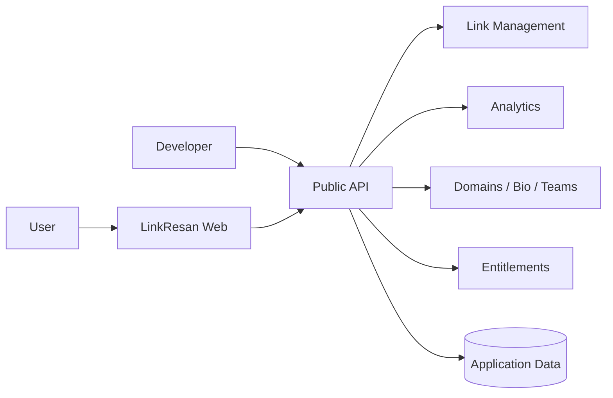

# LinkResan Public Architecture

This document describes LinkResan at product level only.

It intentionally excludes:

- deployment topology
- environment values
- credentials
- database dumps
- customer data
- admin/CRM internals
- private operational evidence

## High-level flow

## Repository boundary

`AmirMotefaker/LinkResan-Production` is the canonical production source.

`AmirMotefaker/LinkResan` is a public-safe product showcase and developer resource.

Production implementation is not mirrored automatically.
