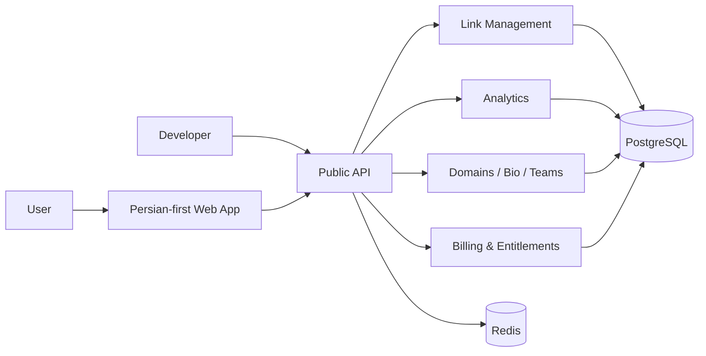

# LinkResan public architecture

This document intentionally describes LinkResan at a product/developer level only. It is not a deployment runbook and must not contain environment values, service identifiers, credentials, database URLs, gateway evidence, admin/CRM internals, or private operational topology.

## Product-level flow

## Publicly documented responsibilities

### Web application
- Persian-first RTL product experience.
- Account, dashboard, link-management and pricing surfaces.
- Uses the public API contract rather than publishing private backend implementation details.

### API
- Link creation and management.
- Analytics entry points.
- Developer API-key and webhook capabilities.
- Product domains such as custom domains, link-in-bio and teams.
- Server-authoritative entitlement enforcement.

### Data layer
- PostgreSQL is the durable application datastore.
- Redis is used as a cache/runtime acceleration layer.

### Billing boundary
Rial payment is a shipped product capability. Public documentation may describe the user-visible lifecycle and verified behavior, but it must not publish merchant credentials, gateway identifiers, reconciliation evidence, database implementation, or private operational procedures.

### Admin / CRM boundary
Admin and CRM capabilities are part of the private commercial Production implementation. Public material may state that founder/admin customer intelligence exists after Production acceptance, but source code, internal fields, operational evidence and private support data are not part of the public snapshot.

## Source-of-truth boundary

`AmirMotefaker/LinkResan-Production` is the only canonical Production source repository.

`AmirMotefaker/LinkResan` is a sanitized public product showcase and developer-facing record. It must never be treated as a deployable mirror of Production.
